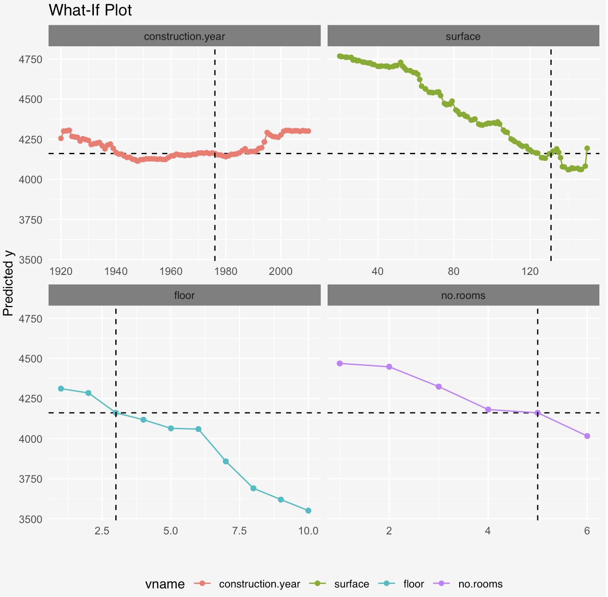
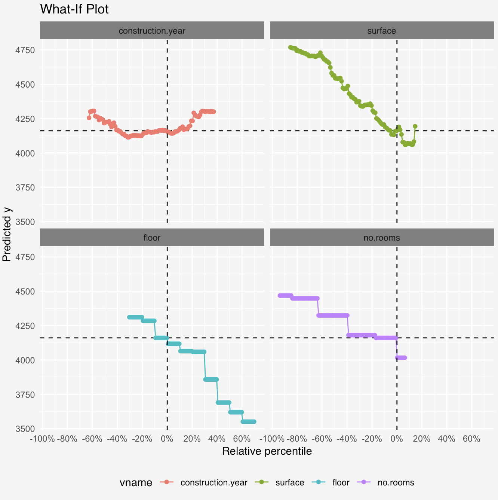
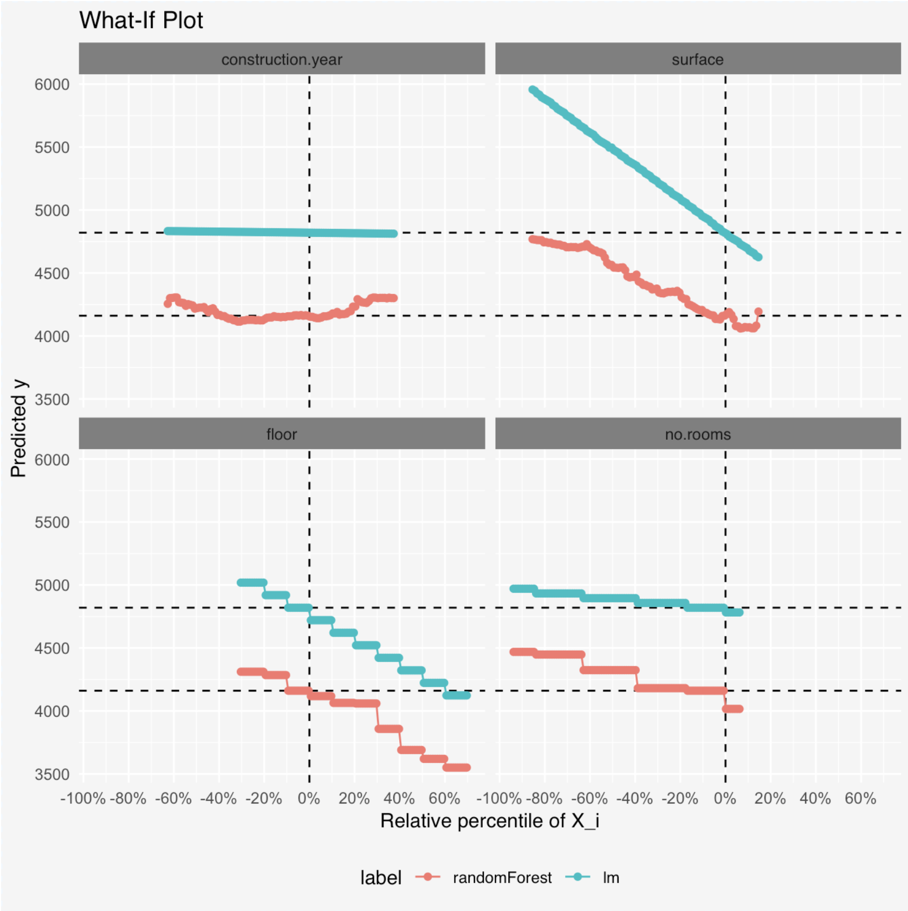
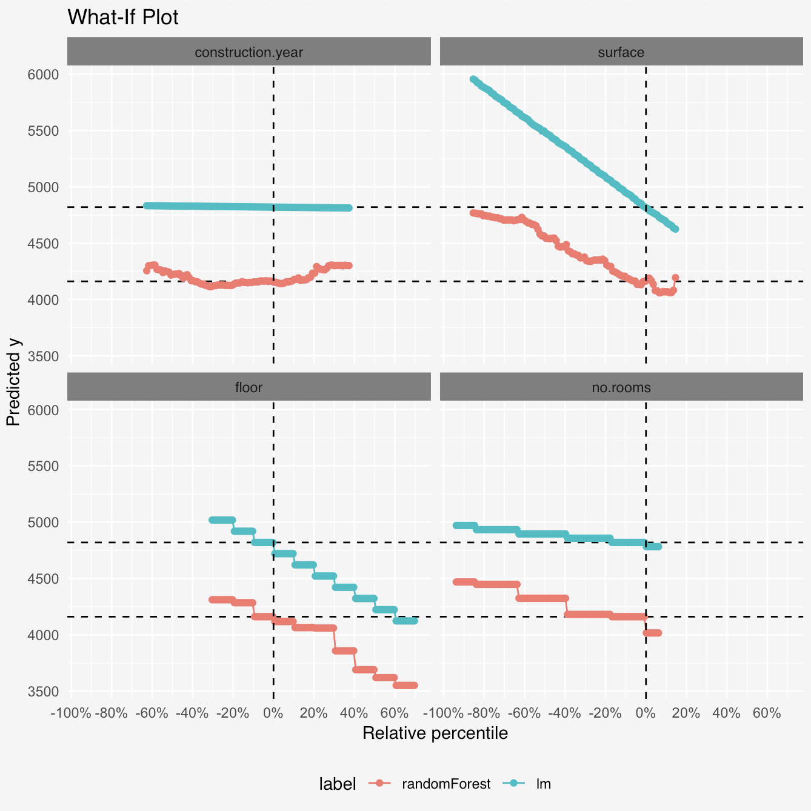

# Ceteris Paribus Plots 

[](https://cran.r-project.org/package=ceterisParibus)
[](http://cranlogs.r-pkg.org/badges/grand-total/ceterisParibus)
[](https://travis-ci.org/pbiecek/ceterisParibus)
[](https://codecov.io/github/pbiecek/ceterisParibus?branch=master)
[](https://mybinder.org/v2/gh/pbiecek/ceterisParibus/master?filepath=jupyter-notebooks)

*Ceteris Paribus Plots* (What-If Plots) are designed to present model responses around a single point in the feature space. For example around a single prediction for an interesting observation. Plots are designed to work in a model-agnostic fashion, they are working for any Machine Learning model and allow for model comparisons.

The [ceterisParibus]( https://github.com/pbiecek/ceterisParibus) Plots supplement the [breakDown Plots]( https://github.com/pbiecek/breakDown) that are designed to attribute features into parts of a single prediction.

Imagine a scenario in which a client gets low credit score and is wondering why the score is so low. *What can I do to get a higher score?*

Ceteris Paribus Plots show possible scenarios for model predictions allowing for changes in a single dimension keeping all other features constant (the *ceteris paribus* principle).

See a short 100 secs introduction to the package [on YouTube](https://youtu.be/ya1SEWFXN08).

[](https://youtu.be/ya1SEWFXN08 "100 sec into ceterisParobis package")

Find more about Ceteris Paribus Profiles in this [Gentle introduction to DALEX with examples](https://pbiecek.github.io/DALEX_docs/5-ceterisParibus.html#ceterisParibus) or in the cheatsheet presented below.

<a href="cheatsheets/CeterisParibusCheatsheet.pdf">

</a>

## Installation

To get started, install the latest version of **ceterisParibus** from CRAN

```
install.packages("ceterisParibus")
```

or from GitHub:

```
devtools::install_github("pbiecek/ceterisParibus")
```

# Simple Ceteris Paribus Plot

The plot below shows Ceteris Paribus plots for an apartment data for a large apartment (130 m2) on 3-rd floor. On can read what would be the model prediction for smaller apartment (largest change) or one that is located higher.

<center></center>

# Uniform Ceteris Paribus Plot

Since different variables may have different scales, we recommend to transform variables into quantiles. Then it is much easier to see how a particular variable looks in relation to others.

<center></center>

Having all variables in a single quantile scale we may plot them together in a single plot.

<center></center>

# Multimodel Ceteris Paribus Plot

We may compare responses for few models in a single plot.

<center></center>

# Some equations

More formally, a Ceteris Paribus plot for variable V and observations O is a set of points (X, Y) where

$$Y(X) := f(O_1, ..., O_{V-1}, O_{V} + X, O_{V+1}, ..., O_{p})$$


# More examples

https://pbiecek.github.io/ceterisParibus/articles/whatIf1d.html

